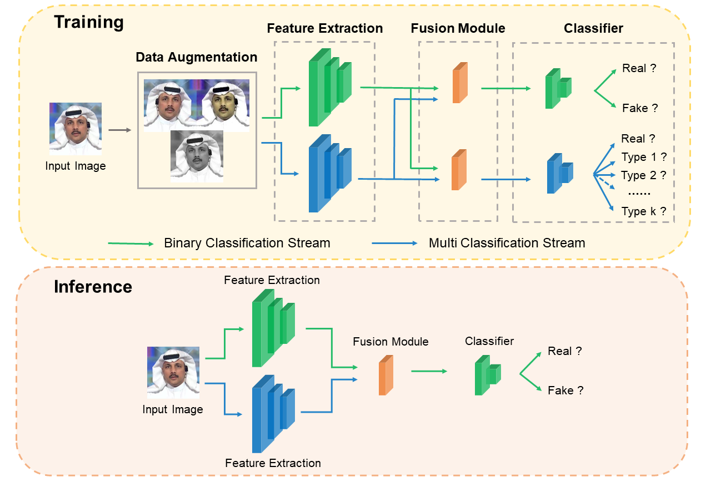

# Multi-To-Binary: A Generalizable Deepfake Detection Approach with Multi-Classification Guidance
This is the official code for the paper "Multi-To-Binary: A Generalizable Deepfake Detection Approach with Multi-Classification Guidance".
## Abstract
Visual content forgery techniques, such as Deepfake, have rapidly advanced in recent years. Due to the potential misuse of these techniques for malicious purposes, there is increasing attention to the corresponding detection methods. Most existing methods focus on specific forgery patterns, making it difficult to detect forgeries with unknown or evolving patterns. In this work, we propose a novel forgery detection framework designed to extract comprehensive features utilizing multiple classification models. More specifically, our proposed framework consists of both binary-classification and multi-classification models working collaboratively, enhanced by innovative fusion and freezing mechanisms to improve accuracy and efficiency. We conducted extensive experiments to evaluate the performance of our approach. The results demonstrate that our approach outperforms state-of-the-art techniques in terms of generalization to new forgery patterns and robustness against various types of forgeries. This demonstrates promising effectiveness for real-world applications where forgeries can be diverse and sophisticated.

## pipeline
<p align="center">

</p>

## Requirements
```
conda create -n m2b python=3.9
conda activate m2b
pip install torch==1.9.0+cu111 torchvision==0.10.0+cu111 torchaudio==0.9.0 -f https://download.pytorch.org/whl/torch_stable.html
pip install -r requirements.txt
```

## Training
### Prepare datasets
Prepare face forgery datasets: [FaceForensics++](https://github.com/ondyari/FaceForensics), [Celeb-DF](https://github.com/yuezunli/celeb-deepfakeforensics), [DFD](https://research.google/blog/contributing-data-to-deepfake-detection-research/), [DF-1.0](https://github.com/EndlessSora/DeeperForensics-1.0/tree/master/dataset).
### Train Models
```
python train.py --train_folder [your_train_path] --val_folder [your_val_path] --out_folder [your_output_path] --batch_size 16 --epoches 32
```

## Testing
```
python test.py --test_path [your_test_path] --batch_size 16
```
